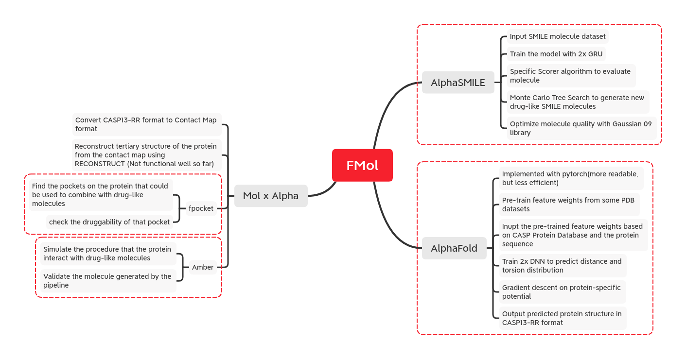

# FMol
A simplified drug discovery pipeline -- generating SMILE molecular with AlphaSMILE, predicting protein structure with AlphaFold, and checking the druggability with fPocket.

## Todo
As we can tell from the descrption, there would be 3 parts of the project(molecule, protein, and mol-x-protein). I have merged AlphaSMILE into the repo and it should works well if the environment sets up well.
* Create conda env requirements
* Create `fmol.py`
* Write more detailed documentation
* Maybe, create visualized configurator to config `rnn` and `mcts` used in AlphaSMILE

## What's stucked
* The output file of alphafold comes in `.rr` [casp13-rr format](https://predictioncenter.org/casp13/index.cgi?page=format). It stores the probability of two atoms on the protein chain could contact within 8 angstroms. But fpocket only accept input file in `.pdb` format, which basically stores the 3-D coordinate information of each atom. Reconstructing reliable PDB file from the CASP13-RR file is still an unsolved problem in academic circles. [RECONSTRUCT](http://www.bioinformatics.org/owl/reconstruct/) is a third-party software using [TINKER](https://dasher.wustl.edu/tinker/) package aiming to reconstruct PDB file from `.cm` contact map file format, but does not work well. I wrote a tool to convert CASP13-RR format into contact map format(see `utils.rr_to_cm`).
* Deepmind didn't open-source the procedure of protein tertiary structure prediction, especially the part of training model from CASP PDB dataset. However, it's essential to the accuracy of prediction of arbitrary protein structure. 

## Copyright Clain
To make the project easier to deploy on the cloud, I copied and merged some repos into this project according to their licence.
* [AlphaSMILE](https://github.com/Cyril-Grl/AlphaSMILES)
* [alphafold_pytorch](https://github.com/Urinx/alphafold_pytorch)
